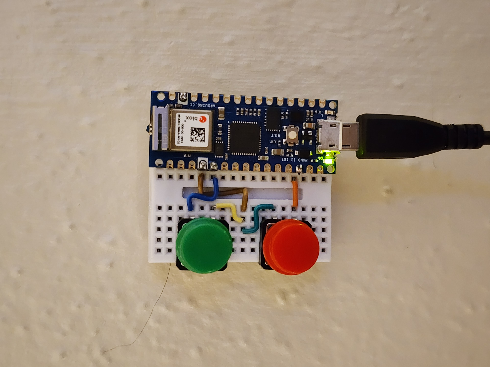

# smart-things-switch

An Arduino Nano 33 IoT SmartThings light switch.

This project requires a SmartThings Personal Access Token (PAT) generated before December 30th 2024. Otherwise, the token will need to be changed every 24 hours.

## License

GPL-3.0 License
